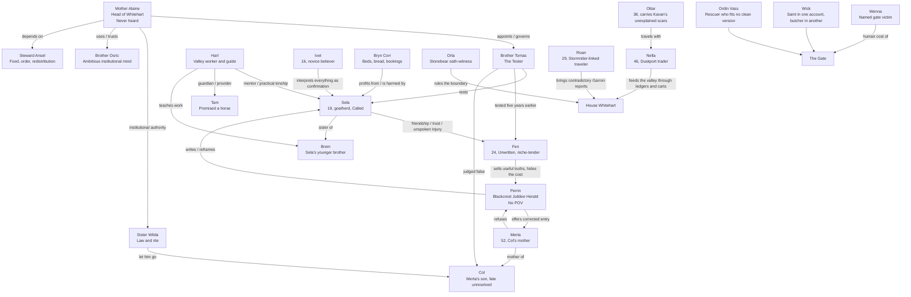

# EMBERWOLD — CHARACTER MAP

## Version 27.0 — Book One canon synchronized

**Date:** 15 July 2026  
**Authority:** `Emberwold_Lore_Bible_v27_0.md`  
**Primary prose reference:** `EMBERWOLD_Book_One_Copyedit_Lore_Checked_v31.md`

This file replaces the old provisional character map. It records relationships, knowledge boundaries, institutional positions, and series carry-forward after Book One canon closure.

---

# 1. BOOK ONE CORE

---

# 2. WHITEHART POSITION MAP

| Character | Age | Formal position | Practical function | Private pressure | Book One end-state |
|---|---:|---|---|---|---|
| **Sela** | 19 | Called under testing | Becomes the house's public meaning whether she consents or not | Wants to be believed and left alone; learns these are incompatible | Leaves east without verdict, carrying Harl's knife |
| **Tomas** | 45 | The Tester; sixteen years in office, nine as the Tester | Converts uncertainty into verdict | Knows the instrument may be broken and keeps using it | Leaves the blank page unclosed; remains inside the institution |
| **Alaine** | ~60 | Mother of Whitehart | Governs through stillness, ritual, and controlled memory | Never heard; authored the burn-rule; cannot separate protection from theft | Does not give the order that would stop Sela |
| **Fen** | 24 | Unwritten; no legal personhood in the house's voice | Tends the niches, knows the wall, carries information | Wants to be named and seen; trades truth for recognition | Keeps his betrayal from Sela; remains morally unresolved |
| **Wilda** | — | Senior legal authority | Makes the correct word binding even when it harms | Let Col go and kept silent for sixteen years | Confesses the act, not Col's fate |
| **Osric** | — | Whitehart brother | Organizes, interprets, and converts crisis into usable account | Sincere ambition; sees institutional opportunity quickly | His arranged version becomes politically useful |
| **Ansel** | — | Steward | Food, beds, order, hidden redistribution | Measures survival before doctrine | Helps the house endure while reinforcing its categories |
| **Ivet** | 16 | Novice | Turns ordinary acts into signs | Genuine love makes her dangerous | Carries the myth forward without malice |

---

# 3. VALLEY AND OUTSIDE PRESSURE

| Character | Connection to Whitehart | What they want | What they expose |
|---|---|---|---|
| **Merta** | Stands below the boundary every first snow | Col's name returned to ordinary human speech | The cost of a decision that never ends |
| **Col** | Judged false by Tomas; released by Wilda | Unknown; fate unresolved | The difference between a verdict and a life |
| **Harl** | Sela's practical elder and guide | A profitable summer, a roof, a horse for Tam, his standing intact | How public authority removes private room to change one's mind |
| **Tam** | Harl's boy | The promised horse | The intimate cost left after abstract tragedy |
| **Brem** | Sela's younger brother | Ordinary family speech and safety | How reverence enters the home |
| **Bryn Corr** | Valley entrepreneur | Beds filled, bookings honored, roof paid | Sela as economic weather |
| **Perrin** | Blackcrest Jubilee Herald | A usable account and a place inside history as more than the hand | The mercy and violence of writing people down |
| **Orla** | Stonebear oath-witness | A ruling that keeps the word exactly | Honor that is defensible and ruinous |
| **Nella** | Ravenshade-linked Duskport trader | A functioning ledger, paid risk, moving food | Information and logistics as life-saving power with a price |
| **Roan** | Stormrider-linked traveler | To carry what he has heard without pretending certainty | Garron's death as contradictory political weather |
| **Ottar** | Servant in Nella's party | Not stated | Kavan's violence shown through scars, not exposition |

---

# 4. KNOWLEDGE ASYMMETRY MAP

The book's bond engine depends on unequal knowledge. These boundaries are locked.

| Secret / uncertainty | Reader | Sela | Tomas | Alaine | Fen |
|---|---|---|---|---|---|
| Alaine has never heard | Knows | Does not know | Does not know | Knows | Does not know |
| Alaine authored the burn-rule | Knows | Does not know | Does not know | Knows | Does not know |
| Fen sold information about Sela's fear | Knows | **Does not know** | Does not know | Does not know | Knows |
| Wilda let Col go | Learns | Learns only when revealed publicly | Learns | May infer / no settled proof before confession | Learns |
| Col's fate | Unknown | Unknown | Unknown | Unknown | Unknown |
| Whether the voice is supernatural | Unknown | Unknown | Unknown | Unknown | Unknown |
| Whether Alaine turned before Sela | Unresolved | Does not know | Cannot establish | Cannot establish | Does not know |
| Grave origin and keeper lineage | Unknown | Unknown | Unknown | Unknown or withheld; never confirmed | Unknown |

**Continuity law:** no future revision may collapse these gaps casually. A knowledge transfer must occur on the page and becomes a canon event.

---

# 5. BOOK ONE ARC MAP

| Character | Beginning | Irreversible bend | End |
|---|---|---|---|
| **Sela** | Speaks plainly and expects words to remain hers | Her denial becomes proof; her warning becomes law; Harl dies despite taking the safe route | Chooses movement over verdict and walks east |
| **Tomas** | Trusts the rite because he bears its burden carefully | Sees the blank page, Col, the unknown grave, Perrin's questions, and the house acting without testing | Leaves one page unclosed and remains the Tester |
| **Alaine** | Believes control and silence are the same as protection | Sela, Perrin, the grave, and the unburned comparisons disturb the architecture | Refuses one final act of control; does not confess |
| **Fen** | Survives by humor, usefulness, and private names | Perrin makes attention feel purchasable; Fen discovers information can buy public existence | Gains leverage, loses innocence, hides the worst truth from Sela |
| **Merta** | Repeats the same vigil for sixteen winters | Refuses Perrin's corrected entry because mercy written by power remains power | Becomes a moral witness who cannot be absorbed into the house's version |
| **Wilda** | Correct law, controlled speech, sixteen years of silence | Admits she let Col go | Remains neither absolved nor reduced to villainy |
| **Perrin** | Believes useful versions can prevent harm | Merta names what his kindness does; Fen gives him access he should question | Leaves morally compromised and still defensible |
| **Harl** | Practical, proud, useful, loved | Publicly stripped of the ability to change course without humiliation | Dies on the neck; his knife and promised horse carry the cost forward |

---

# 6. THE TEN HOUSES — CURRENT LEADERSHIP FIELD

| House | Philosophy | Seat | Head / central leader | Heir / next pressure | Book One contact |
|---|---|---|---|---|---|
| Blackthorn | Intellect | Thorn Hall | Alder | Wren | Named trace only |
| Ravenshade | Information | Duskport | Sabra | Lyra | Nella and Duskport carts |
| Ashbourne | Courage | Dawnwatch | Roderick | Kael | Named trace only |
| Whitehart | Faith | Bell of Silence | Mother Alaine | No dynastic heir; Sela becomes the public center | Lived house |
| Stormrider | Unity | the Hub | Garron, the Binder | Una / Orrin / Katla field unresolved | Roan, Ottar, Garron rumors |
| Ironvale | Innovation | Forge Gap | Master Halvard | Senna | Named trace; no ghost road |
| Blackcrest | Victor's history | Crown-watch | Chronicler Aldous | Vaela | Perrin records the valley |
| Stonebear | Honor | Oath-hold | Reverend Torvald | Rurik | Orla rules the boundary |
| Tidebreaker | Knowledge | the Wave-Reader | Sea-Reverend Maren | Espen | Named trace only |
| Phoenix | The future | New-Ash | Dawnkeeper Signe | Idun | Named trace only |

---

# 7. SERIES CARRY-FORWARD

## Locked carry-forward

- Sela is beyond Whitehart's map, still without certainty.
- Tomas remains inside the institution with an unclosed page.
- Alaine remains in power unless changed on-page later.
- Fen remains Unwritten and keeps the secret of what he sold.
- Col remains unresolved.
- Garron's death destabilizes the wider realm; Garron never appears alive on-page in Book One.
- Kavan is world canon, but Book One contains no explanatory dossier.
- Ashen Crown remains outside the Ten and is not the forgotten eleventh.

## Open future pressure

- Which house becomes the dominant house of Book Two.
- Whether Perrin's Book One record becomes mercy, weapon, or both.
- Whether Sela's false quotation outruns her.
- What Fen does with information once he understands its price.
- Whether Tomas can continue testing without changing the rite.
- What Alaine does when silence no longer protects the same world.

---

# 8. CHARACTER MAP MAINTENANCE RULE

Update this file whenever any of the following changes:

1. a character learns a locked secret;
2. a physical tell changes permanently;
3. a title, age, kinship, legal status, or house affiliation changes;
4. a held character enters prose;
5. a future-book POV is approved;
6. a death, disappearance, marriage, inheritance, or succession becomes canon.

The Lore Bible remains the authority. This map is the operational relationship layer.
